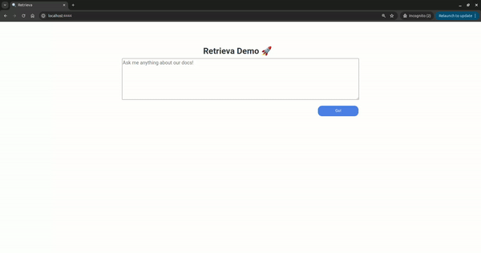

# Retrieva
Retrieva: Smart Documentation Retrieval based on LlamaIndex.

As the name says, this repo implements a RAG (Retrieval-Augmented Generation) arquitecture that can use only local models or remote ones:
   - OpenAI APIs for the LLM and embedding generation
      - *gpt-3.5-turbo* for the LLM and *text-embedding-ada-002* for the embeddings
   - or you can only local models using [Ollama](https://ollama.com/)
      - [zephyr-7b-beta.Q5_K_M](https://huggingface.co/TheBloke/zephyr-7B-beta-GGUF/blob/main/zephyr-7b-beta.Q5_K_M.gguf) as the LLM and *BAAI/bge-small-en-v1.5* for embeddings

# Setup

You will need, in the root:
- a `.env` file with:

   - OPENAI_API_KEY=<OPENAI_API_KEY>
   - RAG_API_URL=http://localhost:3333  # or whatever the address is
   - WEAVIATE_URL=http://localhost:10080  # or other weaviate db url
   - DATA_FOLDER_PATH=./artifacts/sagemaker_documentation  # or other path to the docs
   - USE_CLOUD_PIPELINE=0 # or 1 to use the remote models (openAI api)

- an "artifacts" folder with the data (example: artifacts/sagemaker_documentation)

# Running the project

The easiest way is to `docker compose up` and it will start up every service needed.

- API swagger at *http://localhost:3333/docs*.
- webapp available at *http://localhost:4444*.

You can run the services individually with `make local-api` and `make local-dash`. To run the LLM with ollama, locally:
   -	run `source ./retrieva/ollama/install_ollama.sh`
	- run `source ./retrieva/ollama/model_download.sh`
   - change the path of to where the downloaded model is in [Modelfile](/retrieva/ollama/Modelfile)
	- run `ollama create zephyr-local - retrieva/ollama/Modelfile`
   run `make setup-local-llm`. command. You just need to give the complete path to where the model is download

NOTE: the notebooks folder has examples of the main objects of the project:
- you can make requests to the api in the [testing_api](/notebooks/testing_api.ipynb)
- the notebook [handler_testing](./notebooks/handler_testing.ipynb) shows how to use the RAG handler object, that contains all the logic

# Points of Action/Features:

- [x] RAG Pipeline to query documentation using LLamaIndex
   - [x] Option to use local models or cloud ones
   - [x] Prompt engineering (role, negative prompt)
   - [x] Embeddings saved in local weaviate service
   - [ ] Production monitoring
- [x] Prompting through FastAPI with streaming
   - [ ] Middleware for auth
   - [ ] Routes to update indexes
   - [ ] Add https
- [x] Demo webapp
   - [ ] Add https
- [x] Containerized deployment
   - [ ] Infrastructure as code (ideally with CI/CD)
